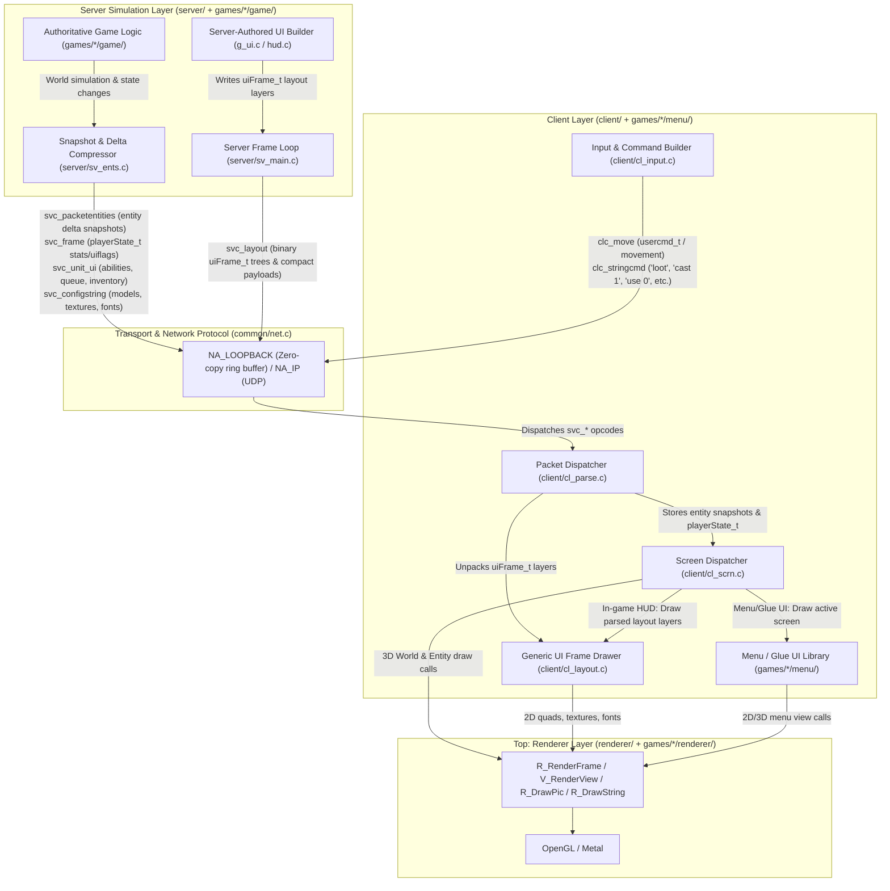
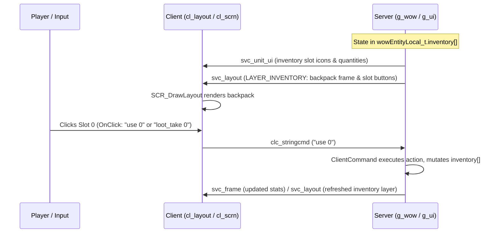
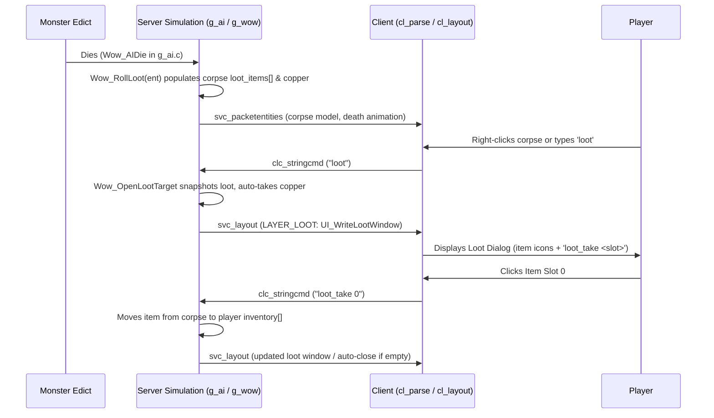

# OpenWarcraft Architecture

For the source-verified boundary/API assessment and proposed shared input/config direction, see the
[multi-game architecture review](docs/architecture/multi-game-review.md). That review distinguishes current
implementation from intended architecture; in particular, the `clc_move` examples below are not implemented by
the current server parser.

OpenWarcraft is an id-Tech (Quake 2 / Quake 3) inspired engine designed to run Warcraft III, World of Warcraft, and StarCraft II assets and game modes. The architecture strictly separates authoritative server simulation, client presentation, network protocols, client-side UI, and low-level rendering.

---

## 1. High-Level Engine Layers & Data Flow

The engine is structured as vertical layers communicating through explicit function tables (vtable exports/imports) and network message buffers (loopback ring buffers for single-player/local listen-server, UDP sockets for multiplayer).



---

## 2. Layer Responsibilities & Interfaces

| Layer | Directory | Responsibilities | Key APIs / Entry Points |
|---|---|---|---|
| **Renderer (Top)** | [renderer/](renderer/) + [games/<game>/renderer/](games/) | Low-level drawing: world terrain, models (MDX/M2/M3), water, particles, 2D sprites, font glyphs. Agnostic of game rules. | [renderer/r_main.c](renderer/r_main.c), `refexport_t` (`re`), `R_BeginFrame`, `R_RenderFrame`, `R_EndFrame`, `R_DrawPic` |
| **Client & UI Dispatch** | [client/](client/) | Owns window, input sampling, entity interpolation, screen dispatching, in-game layout rendering via `SCR_DrawLayout()`. | [client/cl_main.c](client/cl_main.c), [client/cl_scrn.c](client/cl_scrn.c), [client/cl_layout.c](client/cl_layout.c), [client/cl_input.c](client/cl_input.c) |
| **Menu / Glue UI Library** | [games/<game>/menu/](games/) | Client-side menus, glue screens, character creation/selection, loading screens (Quake 3 style UI module). | `menuExport_t` (`menu`), `uiScreen_t`, `M_GetAPI`, `M_Refresh()` |
| **Transport / Common** | [common/](common/) | Network packet dispatch, loopback ring buffers, VFS / MPQ archives, cvars, command buffer, memory allocators. | [common/net.c](common/net.c), [common/mpq.c](common/mpq.c), [common/cmd.c](common/cmd.c), [common/cvar.c](common/cvar.c) |
| **Server Core** | [server/](server/) | Authoritative server loop, client connection slots, snapshot delta-compression, spatial indexing, packet transmission. | [server/sv_main.c](server/sv_main.c), [server/sv_ents.c](server/sv_ents.c), [server/sv_game.c](server/sv_game.c) |
| **Game Logic (Bottom)** | [games/<game>/game/](games/) | Authoritative simulation: units, combat, AI, spells, loot, quests, inventory, server-authored HUD definitions. | `game_export_t` (`ge`), `game_import_t` (`gi`), `G_RunFrame`, `Wow_RunFrame` |

---

## 3. How UI is Rendered (The Split Model)

A crucial architectural principle in OpenWarcraft is the distinction between **Menu / Glue UI** and the **In-Game HUD**:

```
+---------------------------------------------------------------------------------------+
|                                    UI ARCHITECTURE                                    |
+-------------------------------------------+-------------------------------------------+
|               MENU / GLUE UI              |                IN-GAME HUD                |
|       (Client-Side UI Module)             |     (Server-Authored svc_layout)          |
+-------------------------------------------+-------------------------------------------+
| - Runs entirely on client                 | - Authored on server (g_ui.c, hud.c)      |
| - Defined by FDF / FrameXML / catalogs    | - Serialized as binary uiFrame_t arrays   |
| - Driven by uiScreen_t controllers        | - Sent via svc_layout wire packets        |
| - Handles menus, login, char create,      | - Generic client drawer (cl_layout.c)     |
|   options, LAN lobby, loading screen      | - Dynamically updated by server triggers  |
| - Key function: menu.Refresh(msec)          | - Key function: SCR_DrawLayout()          |
+-------------------------------------------+-------------------------------------------+
```

### A. Server-Authored In-Game HUD (`svc_layout`)
1. **Server authors UI frames**: The server game module constructs frames (buttons, health/mana bars, loot windows, action bars, quest dialogs, backpack panels) using `UI_WriteProxyFrame` and `gi.Write(PF_UIFRAME)`.
2. **Binary wire packet**: The server emits a `svc_layout` packet containing a layer ID (e.g. `LAYER_HUD`, `LAYER_INVENTORY`, `LAYER_LOOT`, `LAYER_QUESTDIALOG`), followed by delta-compressed `uiFrame_t` structures and compact wire payloads (such as 10-byte `uiScrollBarImage_t`).
3. **Generic client rendering**: The client receives `svc_layout` in [client/cl_parse.c](client/cl_parse.c) and stores the frame tree in [client/cl_layout.c](client/cl_layout.c). In [client/cl_scrn.c](client/cl_scrn.c), `SCR_DrawLayout()` draws all active layout layers. The client has zero game-specific knowledge of the HUD content—it simply executes draw instructions for the frames.
4. **Layer visibility control**: The server controls which HUD layers are visible using the `uiflags` bitmask in `playerState_t` (`1 << layer`).
5. **Entity-context layers**: The server can declare generic bindings such as context name, health, and mana. For `LAYER_WORLD_HOVER`, the client chooses the recipient-filtered `cl.hover_entity`, projects its model-authored overhead point every render frame, and resolves those bindings from the existing `entityState_t` snapshot and `CS_GENERAL` pool. Mouse movement and projection do not make a server round trip; the server still owns the frame tree, resources, bindings, and visibility.

### B. Dynamic HUD State Binding
- **Player Stats & Status**: Carried per-frame in `playerState_t` inside `svc_frame` (health, mana, max stats, current target entity, copper, cast progress, `client_ui_state`).
- **Entity Context**: Carried in recipient-filtered `entityState_t` snapshots and configstring pools. Layout context bindings consume these fields locally without a hover/selection RPC.
- **Unit Abilities & RTS HUD**: Authored into `svc_layout` command, inventory, and queue frames. `svc_unit_ui` is retained only as a legacy compatibility parser and must not be extended.
- **Interactive UI Commands**: Buttons created in server-authored layouts specify string commands (e.g. `OnClick = "loot_take 0"`, `"cast 1"`, `"use 0"`, `"quest_accept"`). Clicking a button executes the command on the client command buffer, transmitting a `clc_stringcmd` to the server for authoritative execution.

---

## 4. Network Protocols & Wire Packets

All communication uses discrete message opcodes defined in [common/common.h](common/common.h).

### Server to Client Packets (`svc_*`)
| Opcode | Payload / Structure | Purpose |
|---|---|---|
| `svc_frame` | Server frame number, delta frame, `playerState_t` | Per-tick simulation timing, player stats (HP, mana, gold, target, `uiflags`, `client_ui_state`). |
| `svc_packetentities` | Delta-compressed `entityState_t[]` | Visible entity snapshot (positions, rotations, models, animations, effects). |
| `svc_layout` | `BYTE layer`, `uiFrame_t[]`, optional compact payloads | Server-authored UI frame tree for a specific HUD layer. |
| `svc_unit_ui` | `num_units`, entity IDs, buttons, inventory, queues | RTS / WoW unit abilities, quick-bar inventory items, and construction queue state. |
| `svc_configstring` | `SHORT index`, `STRING value` | Pre-cached media registry (model paths, sound paths, texture paths, font names). |
| `svc_serverdata` | Protocol version, map name, player slot | Initial connection handshake and map setup. |
| `svc_spawnbaseline` | `entityState_t` | Baseline delta state for newly spawned entity numbers. |
| `svc_stufftext` | `STRING command` | Server-instructed client command execution. |

### Client to Server Packets (`clc_*`)
| Opcode | Payload / Structure | Purpose |
|---|---|---|
| `clc_move` | `usercmd_t` (msec, buttons, movement, view angles) | Player movement and camera rotation updates every frame. |
| `clc_stringcmd` | `STRING command` (e.g., `"loot"`, `"loot_take 0"`, `"cast 2"`, `"use 0"`) | Game actions, UI button interactions, inventory usage, chat, and console commands. |
| `clc_connect` | Userinfo key-value string | Requesting client slot on server connection. |

---

## 5. Practical Feature Guides: Where to Start

If you are implementing gameplay features, here is how the architectural pieces fit together:

### Workflow: Implementing Backpack & Inventory



1. **State Ownership**:
   - Inventory items are stored in server-side entity records (e.g. `wowEntityLocal_t.inventory[]` in [games/world-of-warcraft/game/g_wow.c](games/world-of-warcraft/game/g_wow.c) or `gameInventoryItem_t` in [server/game.h](server/game.h)).
2. **UI Generation**:
   - The server draws the backpack window using `UI_WriteBackpack` in [games/world-of-warcraft/game/g_ui.c](games/world-of-warcraft/game/g_ui.c), emitting `uiFrame_t` buttons onto `LAYER_INVENTORY`.
   - Each slot button sets its command string to `"use <slot>"` or `"equip <slot>"`.
3. **Visibility & Toggling**:
   - Controlled via `playerState_t.uiflags` or client toggles (`"backpack_toggle"`).
4. **Interaction**:
   - When the user clicks an item slot, `CL_LayoutClick` fires the button's command, sending `clc_stringcmd` (`"use <slot>"`) to the server.
   - `ClientCommand` in [games/world-of-warcraft/game/g_wow.c](games/world-of-warcraft/game/g_wow.c) validates the action, modifies server state, and re-emits updated UI frames.

### Workflow: Monster Kill & Loot Collection



1. **Loot Generation on Death**:
   - In [games/world-of-warcraft/game/g_ai.c](games/world-of-warcraft/game/g_ai.c), `Wow_AIDie()` calls `Wow_RollLoot(ent)` in [games/world-of-warcraft/game/g_wow.c](games/world-of-warcraft/game/g_wow.c).
   - `Wow_RollLoot()` queries `wow_loot_table[]` by creature `display_id`, rolling random copper and drop items into `local->loot_items[]` and `local->loot_copper` on the corpse entity.
2. **Player Interaction**:
   - Player right-clicks the corpse entity or runs the `"loot"` command (`clc_stringcmd`).
   - Server handler `Wow_OpenLootTarget` verifies distance ($\le 10$ units), snapshots corpse items to `client->loot_snap[]`, auto-credits copper to `player->copper`, and sets `client->loot_target`.
3. **Loot Window Rendering**:
   - `UI_WriteLootWindow()` in [games/world-of-warcraft/game/g_ui.c](games/world-of-warcraft/game/g_ui.c) emits `svc_layout` on `LAYER_LOOT` with item rows and buttons bound to `"loot_take <slot>"`.
4. **Item Acquisition**:
   - Clicking an item sends `"loot_take <slot>"`.
   - The server moves the item from corpse storage to the player's first open `inventory[]` slot, syncs the change, and re-emits `svc_layout` (or closes the window with `loot_close` when empty).

---

## 6. Architecture Documentation Index

For in-depth details on specific engine subsystems, consult the following dedicated documents:

### Core Engine & Architecture
| Topic | Document |
|---|---|
| Shared input profiles, config compatibility, and target groups | [docs/architecture/shared-input.md](docs/architecture/shared-input.md) |
| Multi-game client boundaries, API audit, and input/config migration | [docs/architecture/multi-game-review.md](docs/architecture/multi-game-review.md) |
| Server-Authored UI Payloads & Limits | [docs/architecture/ui-payloads.md](docs/architecture/ui-payloads.md) |
| UI System Architecture & Screen Flow | [docs/architecture/ui-system.md](docs/architecture/ui-system.md) |
| Server Architecture & Snapshot Delta Compression | [docs/architecture/server.md](docs/architecture/server.md) |
| Client Architecture, Input & Interpolation | [docs/architecture/client.md](docs/architecture/client.md) |
| Network Transport & Protocol Details | [docs/architecture/network.md](docs/architecture/network.md) |
| VFS, MPQ Loading, and Config Path Resolution | [docs/fs-loading-architecture.md](docs/fs-loading-architecture.md) |
| Native Game Coordinates & Axis Conventions | [AXIS.md](AXIS.md) |
| Runtime Config, Cvars, and Share Directories | [docs/architecture/runtime.md](docs/architecture/runtime.md) |
| Sound System & Entity Audio Architecture | [docs/architecture/sound.md](docs/architecture/sound.md) |
| Warcraft III Game Save/Load | [docs/games/warcraft-3/save-load.md](docs/games/warcraft-3/save-load.md) |
| Fog of War Generation & Algorithms | [docs/architecture/fog-of-war-algorithms.md](docs/architecture/fog-of-war-algorithms.md) |
| Shared Model Shader & Lighting Uniforms | [docs/architecture/model-shader.md](docs/architecture/model-shader.md) |
| Server-Selected Presentation Effects | [docs/architecture/server-selected-effects.md](docs/architecture/server-selected-effects.md) |
| Code Patterns & Struct Disciplines That Work | [docs/code-patterns-that-work.md](docs/code-patterns-that-work.md) |

### Game-Specific Implementations
| Topic | Document |
|---|---|
| WoW Gameplay Features (Loot, Spells, Quests) | [docs/games/world-of-warcraft/gameplay-features.md](docs/games/world-of-warcraft/gameplay-features.md) |
| WoW Quest UI & Dialog Server-Authoring | [docs/games/world-of-warcraft/quest-ui.md](docs/games/world-of-warcraft/quest-ui.md) |
| WoW Creatures, Threat & Think-Function Dispatch | [docs/games/world-of-warcraft/enemies-and-creatures.md](docs/games/world-of-warcraft/enemies-and-creatures.md) |
| WoW M2 Model & Character Customization / DBCs | [docs/games/world-of-warcraft/m2-and-character-display.md](docs/games/world-of-warcraft/m2-and-character-display.md) |
| WoW DBC Format & Schema Reference | [docs/games/world-of-warcraft/dbc-reference.md](docs/games/world-of-warcraft/dbc-reference.md) |
| SC2 HUD Layout Pipeline (`.SC2Layout` $\to$ `svc_layout`) | [docs/games/starcraft-2/hud-layout-pipeline.md](docs/games/starcraft-2/hud-layout-pipeline.md) |
| WC3 SLK Data Model, Units & Combat Formulas | [docs/wc3-data-model.md](docs/wc3-data-model.md) |
| UI Authoring, FDF Conventions & ConsoleUI | [docs/ui-authoring.md](docs/ui-authoring.md) |

---

## 7. Engine & Coding Discipline Rules

- **Strict Engine/Game Boundary**: Modules under `renderer/`, `client/`, `common/`, and `server/` must remain
  completely game-agnostic. No game-specific hardcoded names, paths, or literals in engine files. This also
  covers *symbol names*, not just string literals: an enum member, macro, or struct field named after a
  specific race, faction, unit, or spell (e.g. `EF_BUILDING_FIRE_UNDEAD`) is game-specific even when its
  underlying type is a generic bitmask. If behavior depends on which race/unit/spell is involved, resolve it
  inside `games/<game>/` and expose only a generic index/model reference plus explicit discriminant flags to
  the shared struct — see `entityState_t.effect` / `effect_flags` (`common/shared.h`) as the reference
  pattern, and `games/warcraft-3/game/skills/s_onfire.c` for where the race-specific resolution belongs.
  Game policies reside exclusively under `games/<game>/`.
  - An `#ifdef <GAME>` guard or hardcoded `strcmp(command, "<game>_...")` branch in a shared dispatcher
    (`CL_ParseGameCommand`, `SV_*`, `R_*`) is also a violation. Use the existing function-table extension
    point instead; for example, `menu.GameCommand(command, payload.data, payload.cursize)` is unconditional.
    If no hook exists, add a function-table entry rather than using `#ifdef` as a substitute.
- **Network Contract Stability**: `entityState_t` and `playerState_t` are tight network contracts. Never add fields without careful justification; prefer existing fields, configstrings, or server-authored UI payloads.
- **Data-Oriented & id-Tech Idioms**: Follow Quake 2 patterns (`g_*.c`, `cl_*.c`, `sv_*.c`, `r_*.c`). Favor flat, memory-mapped structs, single-pass schema tables, and thin interfaces over heavy OOP abstractions.
- **No Silent Fallbacks or Demotions**: If an asset or resource fails to load, log a clear diagnostic. Do not hide bugs behind silent fallback flags. Verify root causes with logging and tests before committing fixes.
