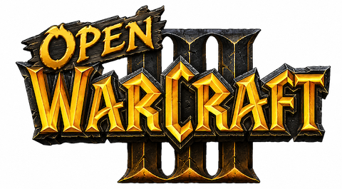
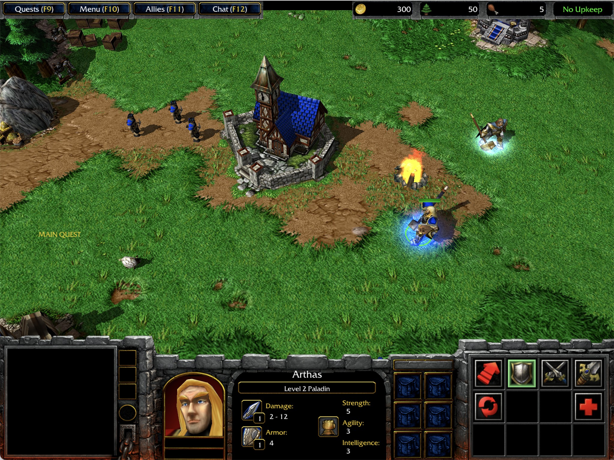
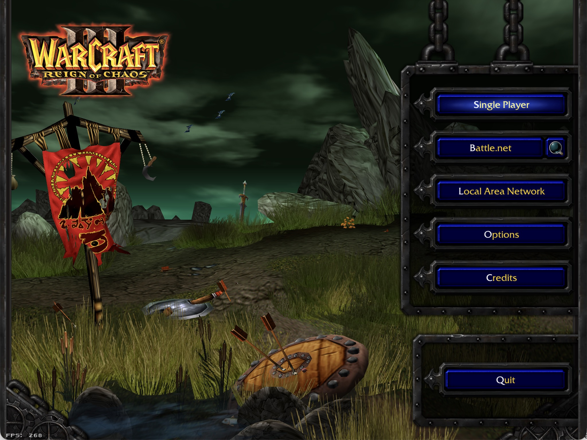

<p align="center">
  
</p>

**OpenWarcraft3** is an open-source implementation of Warcraft III that uses SDL2 and runs on Windows, Linux, and macOS.

It was developed using War3.mpq from Warcraft III v1.0 as reference, with ongoing support for version 1.29b.

<a href="https://corepunch.github.io/openwarcraft3/">📖 Documentation</a> · <a href="https://youtu.be/vg7Jm046vcI">▶ Watch the demo on YouTube</a> · see screenshots below

## Download

Pre-built binaries for Linux and macOS are available on the [Releases page](https://github.com/corepunch/openwarcraft3/releases/latest).

You can also download the latest build artifact from the [CI workflow runs](https://github.com/corepunch/openwarcraft3/actions/workflows/c-cpp.yml) (click the most recent successful run and download `openwarcraft3-linux-x64`).

<p align="center">
  
  
  <a href="https://youtu.be/EcuoDoOztjA">
  
  </a>
</p>

## Beyond Warcraft III

Warcraft III is the first and most complete target, but the long-term goal is a reusable engine for several Blizzard-era game formats and play styles.

The project is being organized around a small core runtime: client, server, renderer, UI, networking, math, archive loading, console/cvars, and Quake-style module boundaries. Each game then brings its own policy and data formats under `games/<game>/`: game simulation, renderer hooks, UI layer, scripts, tables, models, maps, and tests.

In spirit, this is a little like ScummVM: keep the original game data outside the repository, rebuild the engine/runtime behavior in open source, and let legally owned local assets run through a modern, portable codebase. OpenWarcraft3 is not affiliated with Blizzard and does not ship retail assets; it is an engine and compatibility project for people who already have the original data.

Current and planned targets:

- **Warcraft III** (`games/warcraft-3/`) — main playable prototype and current development focus.
- **StarCraft II** (`games/starcraft-2/`) — next RTS-family target, currently focused on M3 model and renderer groundwork.
- **World of Warcraft** (`games/world-of-warcraft/`) — exploratory world/terrain/model loading target, useful for renderer architecture work.
- **Diablo III** — a future candidate once the shared engine and the RTS/MMO-era targets have matured enough to make another data family worthwhile.

The near-term priority is still Warcraft III. The broader vision is to keep extracting clean reusable engine pieces as that target becomes more complete, so later game reimplementations start from a stronger foundation instead of a fresh pile of hacks.

## Getting Started

### 1. Clone

```bash
git clone git@github.com:corepunch/openwarcraft3.git
cd openwarcraft3
```

### 2. Install Dependencies

The build requires **SDL2**. MPQ reading is handled by the in-tree `common/mpq.c` implementation, and JPEG texture decoding uses the in-tree `renderer/stb/stb_image.h`.

**macOS** (via [Homebrew](https://brew.sh/)):

```bash
brew install sdl2
```

**Linux** (Ubuntu/Debian):

```bash
sudo apt-get install libsdl2-dev
```

**Windows**:

Install SDL2 development libraries and build with a C compiler such as MSYS2/MinGW or Visual Studio. The codebase uses platform-specific directory iteration for Windows, Linux, and macOS when mounting data folders.

### 3. Build

```bash
make build
```

Compiles the engine and game libraries (`shared`, `jass`, `sheet`, `renderer`, `game`, `ui`) and the `openwarcraft3` executable into `build/`.

The default Warcraft III libraries are built from engine sources plus `games/warcraft-3/`. Warcraft III-specific script, sheet, game, renderer, UI, and test sources live under that tree. Alternate game builds use the same engine sources with `games/world-of-warcraft/` or `games/starcraft-2/`.

Viewer tools are also built into `build/bin/`:
- `mdxtool` — model viewer
- `maptool` — map viewer
- `mpqtool` — archive inspection (`ls`, `cat`, `pack`)
- `blp2jpg`, `blpgen`, `mdxgen` — asset conversion/generation helpers

### 4. Run

```bash
make run
```

Runs `openwarcraft3` from `build/bin/` using the data folder configured in the Makefile.

The executable expects a Warcraft III data folder rather than a single archive:

```bash
build/bin/openwarcraft3 -data "data/Warcraft III"
```

The data folder is scanned for top-level `.mpq` archives and an optional loose `Maps/` directory. This lets newer installs expose multiplayer maps from the filesystem while older assets can still be loaded from MPQs.

To start a game from the normal client menu, click **Single Player**, then **Campaign**, then choose a campaign race. The current Single Player flow launches the first available campaign map for the selected race:

- Tutorial: `Maps\Campaign\Prologue01.w3m`
- Human: `Maps\Campaign\Human02.w3m`
- Orc: `Maps\Campaign\Orc01.w3m`
- Undead: `Maps\Campaign\Undead01.w3m`
- Night Elf: `Maps\Campaign\NightElf01.w3m`

These are MPQ-internal paths, so campaign maps may not appear in the loose `data/Warcraft III/Maps/` directory even when they are present in `War3.mpq`. You can inspect them with `build/bin/mpqtool -mpq "data/Warcraft III/War3.mpq" ls Maps/Campaign`.

Useful run targets:

- `make run` — start the client menu using `WC3DATA`
- `make run-map` — start a listen-server game using `MAP`
- `make run-ui-text` — render one UI frame through the stdout renderer

The stdout UI renderer is meant for layout and draw-call debugging without opening a window or taking screenshots:

```bash
make run-ui-text
```

That expands to:

```bash
build/bin/openwarcraft3 -data data/Warcraft\ III +r_module stdout +com_frame_limit 1 +menu_main
```

It prints calls such as `draw_portrait`, `draw_sprite`, `draw_image`, `draw_text`, and `draw_sys_text`, then exits after one frame.

### In-game console

OpenWarcraft3 includes a Quake-style console for diagnostics and runtime commands. Press backtick/tilde to open or close it, press Enter to run a command, use Up/Down for command history, and press Tab to complete command and cvar names.

The console accepts the same commands and cvars used by the command line. For example, `map "Maps\Campaign\Orc01.w3m"` starts a listen-server game directly, while `menu_main`, `menu_credits`, and `menu_options` switch client-side menu screens.

### Configuration and cvars

OpenWarcraft3 uses Quake-style cvars and config files. Defaults live in `share/default.cfg`; generated user settings are written to `share/config.cfg`; optional local overrides can be placed in `share/autoexec.cfg`.

Config load order:

1. Built-in cvar defaults
2. `share/default.cfg`
3. `share/config.cfg`
4. `share/autoexec.cfg`
5. Command-line launch args such as `-data data/Warcraft\ III`, command-line cvars such as `+r_module stdout`, and queued commands such as `+map Maps\\Campaign\\Orc01.w3m` or `+menu_main`

Common runtime cvars:

| cvar | Default | Purpose |
|------|---------|---------|
| `data` | `""` | Saved Warcraft III data folder |
| `map` | `""` | Internal map path for listen-server mode |
| `connect` | `""` | Remote server address |
| `r_module` | `"renderer"` | Renderer backend: `renderer` or `stdout` |
| `ui_module` | `"ui"` | UI module name for the Quake-style module boundary |
| `g_module` | `"game"` | Game module name for the server game boundary |
| `com_frame_limit` | `"0"` | Exit after N frames; useful with `r_module=stdout` |

### (Optional) Download Warcraft III 1.29b assets

```bash
make download
```

Downloads a ~1.2 GB installer from `archive.org` into the `data/` folder. Skip this step if you already have a Warcraft III installation and update the `WC3DATA` variable in the Makefile to point to that data folder.

### (Optional) Set up World of Warcraft assets

The World of Warcraft target expects rebuilt MPQ archives under
`data/world-of-warcraft`.

1. Download the European Standard Edition ISO archive from
   [archive.org](https://archive.org/details/worldofwarcraftstandardeditioneu).
   On the Archive.org page, use **Download Options** -> **ISO Image**.

   Direct zip link:

   ```bash
   curl -L -o worldofwarcraftstandardeditioneu.zip "https://archive.org/compress/worldofwarcraftstandardeditioneu/formats=ISO%20IMAGE&file=/worldofwarcraftstandardeditioneu.zip"
   ```

2. Unzip the downloaded archive somewhere outside the repository or under a
   local ignored data folder:

   ```bash
   unzip worldofwarcraftstandardeditioneu.zip -d /path/to/worldofwarcraftstandardeditioneu
   ```

   The extracted folder should contain `WoWDisc1.iso`, `WoWDisc2.iso`,
   `WoWDisc3.iso`, and `WoWDisc4.iso`.

3. Extract the ISOs and repack the installer tomes into runtime MPQs:

   ```bash
   make install-wow WOW_ISO_DIR=/path/to/worldofwarcraftstandardeditioneu
   ```

   This builds `isoextract` and `mpqtool`, extracts the four disc images into
   temporary build scratch space, reads `InstallerFileList.xml` from the first
   installer tome, and repacks the game archives into
   `data/world-of-warcraft/*.MPQ`.

   `mpqtool` prints progress while repacking: it logs each output MPQ as it is
   created, prints every source file as it is copied into its destination MPQ,
   and prints a final per-archive file count when each MPQ is finalized. By default the temporary ISO
   extraction under `build/wow-install` is removed after a successful install;
   pass `WOW_KEEP_EXTRACT=1` if you want to inspect it.

---

# Architecture

## Client-Server Architecture

OpenWarcraft3 uses a strict client-server separation where all game logic runs exclusively on the server and clients are responsible only for rendering and input.

The **server** hosts the selected game library. For Warcraft III, the source lives in `games/warcraft-3/game/` and is built as `libgame` behind a Quake-style function table boundary. It maintains the authoritative game state: all entities, their positions, health, current animations, and AI state. The server processes player commands, runs the game simulation each frame, and sends the resulting state to clients.

The **client** (`client/`) captures user input via SDL2, forwards commands to the server, receives the updated game state, and renders it using the renderer API. The generic renderer sources live in `renderer/`; selected-game render policy and model/map formats live in `games/<game>/renderer/`. The client never runs game logic directly — it is purely a display and input layer.

Communication between the client and server happens through the network layer (`common/net.c`), which follows the Quake 2 runtime-dispatch model.  The routing decision is made at runtime on `netadr_t.type`:

- **Loopback** (`NA_LOOPBACK`) — when both server and client run in the same process with `+map`, two 256 KiB ring buffers carry traffic in each direction with zero latency and no socket overhead.
- **UDP** (`NA_IP`) — when the executable is started with `-connect <host>`, it binds a non-blocking UDP socket and communicates with a remote listen server over the network.

```
# Listen server (loopback, single process)
SDL2 Input  →  Client (cl_main.c)  →  net.c ring buffer  →  Server (sv_main.c)
                    ↑                                               |
                    └──────────── net.c ring buffer ←──────────────┘

# Remote client (UDP)
SDL2 Input  →  Client (cl_main.c)  →  UDP socket  →  Server (sv_main.c)
                    ↑                                      |
                    └─────────── UDP socket ←──────────────┘
```

See [Network Architecture](doc/architecture/network.md) for the full design, wire format, and CLI reference. See [Runtime Modules and Cvars](doc/architecture/runtime.md) for config files, module cvars, and stdout renderer diagnostics.

## Frame Syncing

The server advances the game in fixed-size time steps. Every frame the server:

1. Reads any pending client commands (`SV_ReadPackets` in `sv_main.c`)
2. Advances the game clock by `FRAMETIME` (100 ms) and calls `ge->RunFrame()` in `g_main.c`
3. Builds and sends a snapshot of the current game state to each client (`SV_SendClientMessages`)

```c
// server/sv_main.c
void SV_Frame(DWORD msec) {
    svs.realtime += msec;
    if (svs.realtime < sv.time)
        return;  // not yet time for a new frame
    SV_ReadPackets();
    SV_RunGameFrame();        // increments sv.framenum, sv.time, calls ge->RunFrame()
    SV_SendClientMessages();  // sends entity state to each connected client
}
```

The client runs at its own rate and simply applies each server snapshot as it arrives. On every client frame (`CL_Frame` in `cl_main.c`) the client reads incoming server messages, processes input, sends commands, and renders the current known state:

```c
// client/cl_main.c
void CL_Frame(DWORD msec) {
    cl.time += msec;
    CL_ReadPackets();   // apply server snapshots
    CL_Input();         // sample user input
    CL_SendCommand();   // forward commands to server
    CL_PrepRefresh();   // build render scene
    SCR_UpdateScreen(); // draw the frame
}
```

### Entity Synchronization and Delta Compression

Each server frame, `SV_BuildClientFrame` (`server/sv_ents.c`) collects the entities visible to a client into a snapshot. `SV_WriteFrameToClient` then compares the new snapshot against the previous one and writes only the fields that changed using `MSG_WriteDeltaEntity`. This delta compression keeps message sizes small even when many entities exist.

The client receives these delta messages in `CL_ReadPacketEntities` (`client/cl_parse.c`) and applies them to its local entity table, keeping `prev` and `current` state for interpolation.

## Projectile System

Ranged attacks spawn a projectile entity (`fire_rocket` in `games/warcraft-3/game/skills/s_attack.c`). The projectile stores a reference to its target entity, a launch speed, a damage value, and a model index for rendering. Its `movetype` is set to `MOVETYPE_FLYMISSILE`.

Each game frame, `G_RunEntity` (`games/warcraft-3/game/g_phys.c`) dispatches on `movetype`. For `MOVETYPE_FLYMISSILE`, `SV_Physics_Toss` moves the projectile straight toward the target's current position at a fixed speed. When the remaining distance is less than the distance traveled this frame, the projectile calls `T_Damage` on the target and frees itself:

```c
// games/warcraft-3/game/g_phys.c
void SV_Physics_Toss(LPEDICT ent) {
    FLOAT distance = ent->velocity * FRAMETIME;
    VECTOR3 dir = Vector3_sub(&ent->goalentity->s.origin, &ent->s.origin);
    if (Vector3_len(&dir) < distance) {
        T_Damage(ent->goalentity, ent->owner, ent->damage);
        G_FreeEdict(ent);
    } else {
        Vector3_normalize(&dir);
        G_PushEntity3(ent, distance, &dir);
    }
}
```

`T_Damage` (`games/warcraft-3/game/skills/s_attack.c`) reduces the target's health. If the target survives and is capable of attacking back, it automatically issues a counter-attack order. If the target's health reaches zero, its `die` callback is invoked.

Because projectiles are regular server entities with a model, they are automatically included in the entity snapshot and rendered on the client without any special handling.

## Unit Movement

When a player right-clicks on the ground, the client sends a command to the server. The server's command handler (`games/warcraft-3/game/g_commands.c`) resolves the selected units and calls `move_selectlocation` (`games/warcraft-3/game/skills/s_move.c`), which:

1. Allocates a **waypoint** entity at the target map position, snapping its Z coordinate to the terrain height (`Waypoint_add` in `games/warcraft-3/game/g_monster.c`)
2. Calls `order_move` on each selected unit, setting the unit's `goalentity` to the waypoint and switching its current move to the walk state

Each server frame, units in the walk state execute `ai_walk` (`games/warcraft-3/game/skills/s_move.c`):

```c
static void ai_walk(LPEDICT ent) {
    if (M_DistanceToGoal(ent) <= unit_movedistance(ent)) {
        ent->stand(ent);        // arrived — switch to idle
    } else {
        unit_changeangle(ent);  // rotate toward goal
        unit_moveindirection(ent); // advance one frame's worth
    }
}
```

After all entities have moved, `G_SolveCollisions` (`games/warcraft-3/game/g_phys.c`) iterates over every pair of overlapping entities and separates them. When two moving units collide, the separation is split proportionally based on each unit's remaining distance to its goal — the unit that is closer to its destination yields more, preventing deadlocks at the destination.

Animation is driven by `M_MoveFrame` (`games/warcraft-3/game/g_monster.c`), which advances `edict->s.frame` each game tick according to the current animation interval. When an animation cycle completes, the `endfunc` of the current `umove_t` is called to transition to the next state (e.g. attack → cooldown → attack again).

## UI System (Phase 8: Client-Side Architecture)

All UI logic runs **client-side** in the selected UI library. Warcraft III UI sources live in `games/warcraft-3/ui/`; the shared client-facing UI API is declared in `client/ui.h`. The server provides only game data (unit abilities, inventory, build queues) through a query protocol. This follows the Quake 3 Arena pattern where UI is a separate client-side library.

### Migration from Server-Side UI

Previously (Phase 1-7), UI logic ran on the server in `game/ui/` and `game/hud/`. This violated the game-agnostic principle and bloated the game library by ~107KB. Phase 8 (May 2026) moved all UI to the client, reducing `libgame.dylib` from 406K to 299K.

### FDF Parsing and Frame Management

The UI library (`games/warcraft-3/ui/ui_main.c`) loads Warcraft III's `.fdf` (Frame Definition File) assets via `UI_ParseFDF` (`games/warcraft-3/ui/ui_fdf.c`). These files describe the hierarchy of UI frames — their type (backdrop, button, label, etc.), textures, fonts, anchor points, and sizes. The UI library maintains the complete frame tree and handles all layout calculation and rendering client-side.

### Unit Data Query Protocol

When the player selects units, the client requests unit data from the server:

**Client → Server:** `clc_request_unit_ui`
```c
// client/cl_input.c — Selection complete
MSG_WriteByte(&cls.netchan.message, clc_request_unit_ui);
MSG_WriteByte(&cls.netchan.message, num_selected);
for (i = 0; i < num_selected; i++)
    MSG_WriteShort(&cls.netchan.message, entity_nums[i]);
```

**Server → Client:** `svc_unit_ui`
```c
// server/sv_unit_ui.c — Query game DLL and respond
gameCommandButton_t buttons[12];
BYTE num_buttons = ge->GetCommandButtons(ent, buttons, 12);

MSG_WriteByte(response, num_buttons);
for (j = 0; j < num_buttons; j++) {
    MSG_WriteString(response, buttons[j].art);
    MSG_WriteString(response, buttons[j].tooltip);
    MSG_WriteString(response, buttons[j].ubertip);
    MSG_WriteString(response, buttons[j].command);
    MSG_WriteByte(response, buttons[j].hotkey);
}
// ... repeat for inventory and build queue
```

**Client Storage:**
```c
// games/warcraft-3/ui/screens/console_ui.c — Cache and render
static uiUnitData_t cached_units[MAX_CACHED_UNITS];
void ConsoleUI_UpdateUnitUI(DWORD num_units, uiUnitData_t *units) {
    memcpy(cached_units, units, sizeof(uiUnitData_t) * num_units);
    // Rendering uses cached_units[] to draw command card
}
```

### Client-Side Rendering

The UI library dispatches rendering to screen controllers (e.g., `games/warcraft-3/ui/screens/console_ui.c` for in-game HUD, `games/warcraft-3/ui/screens/main_menu.c` for menus). Each screen manages its own frame tree and updates frames based on game state. The renderer calls back into client import functions to draw quads, text, and models.

No serialized UI blobs are transmitted over the network. The server is game-agnostic and provides only data.

### Text Renderer Diagnostics

For UI work, use the stdout renderer before reaching for screenshots:

```bash
make run-ui-text
```

This runs the configured UI command for one frame, skips network socket binding, prints draw calls to stdout, and exits without writing `share/config.cfg`. It is useful for checking:

- which textures, models, fonts, and screens were loaded
- button/backdrop rects, UVs, colors, and blend modes
- text content after FDF string translation and Warcraft color-code expansion
- scene placement across commands such as `menu_main`, `menu_startserver`, or `menu_game`

---

## Build System

The default Warcraft III build produces the engine/game libraries and one executable:

1. **libshared** (`shared/`) — mathematics (vectors, matrices, quaternions, geometric primitives); no external dependencies
2. **libjass** (`games/warcraft-3/jass/`) — Warcraft III JASS VM
3. **libsheet** (`games/warcraft-3/sheet/`) — Warcraft III SLK/profile parser
4. **librenderer** (`renderer/` + `games/warcraft-3/renderer/`) — generic renderer backend plus Warcraft III model/map hooks; depends on `libshared`, SDL2
5. **libgame** (`games/warcraft-3/game/`) — server-side Warcraft III game logic; depends on `libshared`
6. **libui** (`games/warcraft-3/ui/`) — client-side FDF parser, command-driven screen controller, and UI renderer
7. **openwarcraft3** — main executable linking the runtime libraries plus SDL2

Alternate builds follow the same shape: `openwow` links `libgame-wow`, `librenderer-wow`, and `libui-wow` from `games/world-of-warcraft/`; `opensc2` links `libgame-sc2` and `librenderer-sc2` from `games/starcraft-2/`.

The renderer module is intentionally compound. Engine renderer code in `renderer/` owns common GL, scene, font, texture, and diagnostic behavior. The selected game's `games/<game>/renderer/` sources implement the `R_Game*` hooks in `renderer/r_game.h`, so the engine renderer does not branch on MDX/M2/M3 model formats.

The module boundary follows the Quake 2/Quake 3 style: subsystems expose function tables (`R_GetAPI`, `UI_GetAPI`, game exports/imports) rather than sharing global implementation details. The cvars `r_module`, `ui_module`, and `g_module` name the active modules. Today `r_module=stdout` selects the text renderer backend; the cvar layout is also the path toward fully dynamic library selection.

The build is driven by a `Makefile` for Linux/macOS. Run `make test` to execute the unit test suite.

### UI Test Enforcement

UI tests are fully repo-owned and deterministic:

1. Source fixtures live under `games/warcraft-3/tests/resources-src/`.
2. Generated test assets are built into `build/tests/resources/`.
3. The packed archive is `build/tests/tests.mpq` (generated, never committed).

`make test` now always runs `make test-assets` first, so the generated UI archive is part of the normal test flow.

Warcraft III-specific test sources live under `games/warcraft-3/tests/`. Engine/tool tests that are not tied to one game remain under the root `tests/` tree.

For UI-impacting changes (`games/warcraft-3/ui/*`, `client/cl_scrn.c`, `renderer/r_draw.c`, sprite/model UI paths), run `make test-ui` before merging. This gate executes parser, layout, end-to-end, and tool-oracle UI suites.

Note: `fdftool` was removed in Phase 8 as it depended on deleted server-side UI code (`game/ui/`).

## External Dependencies

- **MPQ layer** (`common/mpq.c`): in-tree Warcraft III MPQ reader; no StormLib dependency at build or run time. `mpqtool` CLI exposes `ls` and `cat` for archive inspection.
- **SDL2**: windowing, input, and OpenGL context
- **stb_image**: in-tree JPEG texture decoding
- **OpenGL**: 3D rendering (system-provided)

## Current Status
- Functional game implementation with basic Warcraft III features
- Client-side main menu, Single Player menu, campaign selection, and campaign-map launching
- Quake-style runtime console with command history, cvar lookup, and completion
- Client-side Warcraft III FDF UI rendering with stdout renderer diagnostics
- Support for original v1.0 assets with ongoing work for v1.29b compatibility
- Active development focused on expanding game feature completeness
- Cross-platform support for Linux and macOS environments

## License

This project is licensed under the [MIT License](LICENSE). Contributions are welcome!
