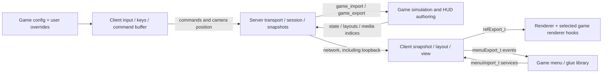

# Architecture and multi-game client review

Source review: 2026-09-09, before the input refactor. The baseline findings below are historical.
See [shared client input profiles](shared-input.md) for the implemented portion and current contracts.

## Assessment

The Quake-style skeleton is sound: the server runs authoritative game code, snapshots carry presentation state,
client code owns input and interpolation, and renderer/menu libraries expose function tables. The main issue is
policy leaking across boundaries, rather than excessive callback counts. A shared client is feasible without a
large new client-game API. Begin with common input mechanisms and config-selected defaults; reserve game-owned
code for behavior that cannot be expressed by a stable shared contract.

“Multi-game” has two distinct milestones: identical game-independent client sources across separately built games,
and one executable that can switch game modules at runtime. The first is a practical incremental refactor. The
second also requires module loading, ABI, filesystem, renderer, and session-lifecycle work. Current game.mk files
compile with WC3/WOW/SC2 and BZ_GAME definitions; removing cl_input_w3.c alone does not achieve runtime switching.

## Current ownership and flow



| Owner | Belongs here | Boundary to preserve |
|---|---|---|
| common/ | VFS, cvars, commands, serialization, transport | No game simulation or presentation policy |
| server/ | Connections, world/session lifecycle, entity linking, snapshots | Calls game API; does not implement unit rules |
| games/*/game/ | Simulation, selection legality, orders, camera scripting, HUD content | Sends state/messages; does not operate the local client's UI directly |
| client/ | Input sampling, bindings, local groups, selection hints, interpolation, generic UI interaction | Consumes recipient-visible state; never decides authoritative control rights |
| games/*/menu/ | Glue screens, menu assets, game-specific UI behavior | Engine services through imports; no direct access to cl or sv |
| renderer/ + games/*/renderer/ | Rendering, model formats, terrain and presentation queries | Picking is a presentation query, not authoritative collision or order validation |

The entry points are GetGameAPI in server/game.h, M_GetAPI in client/menu.h, and R_GetAPI in
client/tr_public.h. SV_InitGameProgs and CL_Init assemble their imports. Renderer-specific game hooks use
renderer/r_game.h. Menu/glue scenes such as games/warcraft-3/menu/menu_glue_scene.c belong on the client side;
server-authored gameplay HUD layouts are a separate path.

The current server/sv_parse.c dispatches clc_camera_position, clc_stringcmd, and clc_request_unit_ui.
WoW movement is formatted as a `move flags yaw pitch distance` string each client input frame and consumed by
Wow_ClientCommand in g_wow.c. It is not the clc_move/usercmd_t flow described in the older overview.
A future typed movement contract should be a deliberate protocol change with server dispatch and game consumption,
not merely a rename of the current input function.

Quake II's relevant pattern is a game-owned entity array with exported stride, server services imported by the game,
and explicit client command/think and lifecycle callbacks. Its renderer already has its own import/export boundary.
Our additional menu library is a reasonable extension; copying Q2's FPS assumptions would not by itself make an
RTS/MMO client generic. See the original [game API](https://github.com/id-Software/Quake-2/blob/master/game/game.h)
and [renderer API](https://github.com/id-Software/Quake-2/blob/master/client/ref.h).

## Import/export audit

Counts below are top-level function-pointer members, excluding data members and nested callback parameters.
They measure surface area, not usage frequency or proof that every entry is necessary.

| Interface | Imports | Exports | Assessment |
|---|---:|---:|---|
| Game (server/game.h) | 33 | 17 | Reasonable size; session/presentation callbacks need attention |
| Menu (client/menu.h) | 27 | 11 | Manageable; legacy HUD structs and full renderer access widen the effective API |
| Renderer (client/tr_public.h) | 10 | 45 | Broadest surface; mostly coherent draw/resource/query operations |

Do not replace these with generic named-command dispatchers to reduce the count. Flat, typed, mandatory tables
are easier to inspect. Do not split them into many sub-tables merely for appearance.

Priority findings:

1. **Server-to-local-client dependency:** SV_InitGameProgs installs `QueueMovie = CL_QueueMovie` and
   `MenuAction = MenuAction`. Deferral protects the active VM stack, but direct local presentation calls are not a
   remote-client contract. Keep world transitions server-owned; route recipient presentation through dedicated
   numbered svc messages and typed handlers. Preserve movie-before-transition ordering and map teardown deferral.
   Audit dedicated/listen/remote behavior separately before changing this lifecycle.
2. **Game-dependent public ABI:** renderEntity_t changes under WOW, exposing display_id, appearance, equipment,
   and attached/overhead models; viewDef_t exposes wc3WeatherEffect_t. A runtime-independent client needs stable
   presentation structs. Resolve game data in game-owned code and transmit/render explicit presentation values.
   Do not replace these with an opaque unbounded payload or arbitrary extra integer slots.
3. **Legacy HUD surface:** menuUnitData_t includes WC3-shaped hero attributes, food, queue, and command-button data.
   UpdateUnitUI still has parser/reset callers, so it cannot simply be deleted. Inventory all producers and consumers,
   keep the legacy parser's compatibility obligations explicit, and retire the API only after migration to layouts.
4. **Renderer access breadth:** menu.GetRenderer returns the entire mutable renderer table, including lifecycle and
   map registration. At minimum prefer const access; narrow it only after auditing actual menu call sites. Const
   prevents mutation, not calls to lifecycle functions. Multiple draw conveniences are a cleanup candidate, not
   evidence that the renderer boundary itself is wrong.
5. **Authoring/transport mixing:** GetThemeValue resolves configstring values during server serialization
   (sv_main.c/sv_user.c). Prefer resolving symbolic game resources before registration, provided edition/map override
   lifecycle remains correct. ResolveImagePath similarly makes client media registration depend on menu state.
6. **Lifecycle and ABI discipline:** these tables have no API-version negotiation. Add version/size validation before
   independent dynamic module selection, and validate mandatory entries at initialization. Existing optional guards
   around UpdateUnitUI, ResolveImagePath, and PlayerCreateMap contradict the mandatory-table direction; establish
   explicit implementations/contracts rather than spreading more guards. PlayerCreateMap also exposes a specific
   character-start workflow that should be reviewed alongside general session startup.

No exhaustive unused-symbol or runtime reachability audit was performed. Callback removal requires that follow-up.

## Shared input and configuration

Control groups are already registered unconditionally by CL_InitInput through CL_ControlGroupsInit in cl_input.c.
The pure append helper and reset live in cl_control_groups.c; state lives in cl.groups. WC3/SC2 bindings already live
in their shipped config.cfg files. This is the right ownership model: common capability, game-specific default keys.

However, WoW clicks update wow_input.selected_entity instead of the common selection cache. Group recall sends
`select id ...`, whereas WoW's handler consumes only argv[1]. Its number keys also serve the action bar. The existing
[control-group guide](../games/warcraft-3/control-groups.md) describes shared availability, not proven equivalent
behavior in all three games. Unify selection hints/reconciliation and define single-target group semantics before
claiming WoW support. Server limits and authority remain game-owned (WC3 currently limits selection to 12).

| Existing behavior | Recommended owner/change |
|---|---|
| Group assign/add/recall, double tap, reset | Shared client; retain game-specific binds and authoritative selection validation |
| Box/click selection and minimap drag | Shared mechanisms selected by an interaction mode; single-target mode is distinct from RTS selection |
| Arrow scrolling, drag pan, edge margin/speed | Shared camera code, neutral cvars and game config defaults |
| Terrain vs camera-plane pan | Explicit camera policy enum; preserve SC2's existing plane behavior |
| Edge-scroll enabled for WC3, compiled out for SC2 | Config default, with shared implementation |
| Shift queue modifier sampled directly through SDL | Bindable held command such as +queue; retain existing wire grammar and server validation |
| WoW mouse sensitivity, click threshold, orbit limits | Neutral client tuning cvars; game defaults in config |
| WoW movement, attack/interact semantics | Server rules remain game-owned; share input state and define the command contract explicitly |
| Confirmation.mdx path in cl_input_w3.c | Game-authored presentation media index; not a generic client literal |
| Login vs main menu in CL_Init | Menu initialization policy or startup command config |
| WC3-only modal gating in CL_GameplayInputReady | Shared modal/input ownership contract |
| WC3 HUD root centering in cl_layout.c | Authored layout/viewport contract, not per-panel C patches |
| WoW camera eye height and appearance translation in cl_view.c | Explicit camera/entity presentation state supplied through the appropriate boundary |

cl_input_w3.c actually serves both WC3 and SC2 under `#ifndef WOW`. Renaming it to cl_input_rts.c would clarify intent,
but would leave its asset literal, game macros, queue modifier, and camera constants unresolved. Prefer shared
cl_camera.c / cl_selection.c mechanisms and a small explicit interaction mode (RTS or orbit), with no game-name tests.
Do not turn configuration into scripting for entity validation, assets that game data resolves, or simulation rules.

Illustrative future config (these cvars and +queue do not exist yet):

```cfg
set cl_input_mode "rts"
set cl_camera_scroll_speed "1400"
set cl_camera_edge_scroll "1"
set cl_camera_pan_surface "terrain"
bind MOUSE2 "+smart"
bind SHIFT "+queue"
bind 1 "group 1"
bind CTRL+1 "group assign 1"
bind SHIFT+1 "group add 1"
```

SC2 would select speed 350, edge scrolling off, and camera-plane pan. WoW would select orbit/single-target behavior
and retain action-bar number binds. These initial defaults preserve current source behavior; they are not new tuning
recommendations. Check how bare modifier +commands compose with modified strokes and key releases before adopting
+queue. Migrate existing saved wc3_/wow_ cvars explicitly so user settings are not silently lost.

The current config load sequence in common/common.c is shipped game config, writable user config, then autoexec.cfg.
Keep that precedence. Defaults belong in games/<game>/share/config.cfg; user overrides must continue winning.

History supports preserving these differences: 4ea4f4eb4 introduced the input split in “Add configurable input
bindings”; f1dc5b80d introduced camera-plane pan in “sc2: preserve scripted camera state”. Treat the latter as a
camera contract to preserve, not an arbitrary macro to remove.

## Suggested implementation order

1. Extract common selection/group command code without changing protocol semantics; reconcile WoW selection state
   and define single-target recall. Keep group availability separate from default bindings.
2. Extract shared RTS/orbit camera mechanisms, replace build-time input differences with explicit modes and neutral
   cvars, then move tuning defaults into shipped configs. Centralize input release on focus loss, modal activation,
   map changes, and disconnect so mode changes cannot retain held buttons or relative-mouse state.
3. Remove remaining client game policy in cl_main.c, cl_layout.c, cl_view.c and public render data. Prefer authored
   snapshot/layout/media contracts. Add a small game-owned presentation hook only where concrete behavior cannot
   fit those contracts; do not grow menuExport_t into a general gameplay module preemptively.
4. Repair server/session presentation routing and audit legacy HUD API consumers. Preserve current transition
   ordering, resource lifetimes, and compatibility until the replacement is verified.
5. If runtime game switching is required, add versioned module loading, consistent public structs, filesystem/config
   reinitialization, and complete shutdown/unload/rebind lifecycle. This is a separate milestone from shared sources.

Verification for implementation should cover all three builds, existing key/group/network tests, bounded map runs,
click/drag and modified-key release behavior, modal capture, scripted cameras, map resets, and listen/remote/dedicated
session transitions. Bug fixes must first obtain targeted runtime log evidence per AGENTS.md; this review does not
claim any runtime bug reproduction. The review itself changed no production code; the subsequent implementation is documented in shared-input.md.

See also: [runtime](runtime.md), [client](client.md), [client windows](client-windows.md), and
[architecture overview](../../ARCHITECTURE.md).
