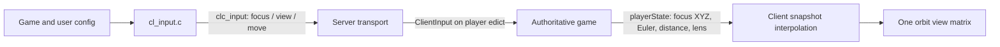

# Shared client input and orbit camera

## Ownership and data flow

Every game builds the same `client/cl_input.c`. There is no input-mode selector or per-game input source.
Pan, edge scrolling, relative mouse look, zoom, movement buttons, hover, and selection are available together.
`cl_selection.c` owns numbered groups and selection hints; `cl_control_groups.c` owns their append/reset helpers.
Game configs choose bindings and independent limits rather than an RTS/orbit mode.



The RTS player is an existing invisible controller edict. WC3/SC2 mirror the resolved focus into that controller's
origin, without adding a model, collision, or an extra network entity. WoW uses its visible player edict and publishes
its complete focus at the actor origin plus game-owned eye height. Camera sampling needs no target entity ID or
special client entity: `playerState.vieworigin` already communicates the resolved world-space point.

The client interpolates both complete focus samples, slerps their Euler-derived quaternions, and builds one
`Matrix4_fromViewQuat` camera. The WoW-only height override in `Matrix4_getCameraMatrix` is gone. Scripts, terrain
height, actor movement, camera target tracking, and lens defaults remain game-owned. WoW's legacy wrapped pitch
is converted inside its game module; the client speaks canonical Euler degrees only.

## Controller API and protocol

`game_export.ClientInput(edict, INPUTCMD)` replaces `ClientSetCameraPosition`, keeping the export count unchanged.
The tagged command carries only one operation. Transport accepts input only for a spawned client's assigned edict.
Malformed or truncated commands are diagnosed and terminate parsing of that packet.

| Action | Payload after action byte | Ownership |
|---|---|---|
| `BZ_INPUT_FOCUS` | 2 float coordinates | RTS changes/clamps its focus; an actor-follow game ignores free panning |
| `BZ_INPUT_VIEW` | 3 float Euler degrees, float distance | Game applies orbit angles/distance and its limits |
| `BZ_INPUT_MOVE` | byte direction bits, unsigned short milliseconds | Game moves its controller or actor |

`clc_input` is opcode 4. `BZ_PROTOCOL_VERSION` is 2: clients and servers must be upgraded together. The old
`clc_camera_position` opcode remains readable and maps to the focus operation. Existing game commands such as
`select`, `smart`, `cast`, and WoW's legacy text `move` remain game commands. This is not a new arbitrary-command
import/export callback.

Movement samples are capped at 250 ms. WoW retains its existing server-tick movement integration and consumes
button state; RTS can integrate an invisible controller from a movement sample. Arrow/edge panning still predicts
absolute focus. Look/zoom predict presentation samples without modifying the authoritative delta baseline. Prediction
ends on a matching snapshot, after 250 ms without input, or when gameplay ownership is lost, so rejected commands
cannot indefinitely hide server state. Menus, modals, map loads, and window focus loss cancel held controls and send
one stop for an actor that was moving. Scripted camera UI ownership takes priority.

SC2's existing Galaxy camera state is shared across its client slots. Manual input now updates that same state,
including preserved height offset; it cannot be overwritten by the next ordinary camera publication. Per-player
Galaxy camera state remains separate future work.

## Configuration

Defaults live in `games/<game>/share/config.cfg`, installed with `make install-share`.

| Setting | WC3 | SC2 | WoW |
|---|---|---|---|
| `cl_start_menu` | `menu_main` | `menu_main` | `menu_login` |
| `cl_selection_limit` | 64 | 64 | 1 |
| `cl_group_focus` | 1 | 1 | 0 |
| `cl_camera_scroll_speed` | 1400 world units/s | 350 world units/s | 0 |
| `cl_camera_edge_scroll` | 1 | 0 | 0 |
| `cl_camera_pan_plane` | 0: terrain | 1: camera plane | 0 |
| `cl_camera_min_pitch` / `cl_camera_max_pitch` | -85 / -5 | -85 / -5 | 5 / 55 |
| `cl_hover_health_only` | 1 | 1 | 0 |
| `cl_context_cursor` | 0 | 0 | 1 |
| `cl_move_mouse` (both buttons forward) | 0 | 0 | 1 |
| `cl_look_command` (look-button click) | empty | empty | `interact` |

All builds register `+select`, `+attack`, `+smart`, `+pan`, `+look`, `+forward`, `+back`, `+moveleft`, `+moveright`,
`+camleft`, `+camright`, `+camnorth`, `+camsouth`, `zoom`, and `group`. Edge/arrow panning follows camera yaw.
Mouse sensitivity defaults to `cl_mouse_speed 0.18` degrees/pixel, click threshold to 10 pixels, and edge margin to
6 pixels. Existing `zoom_speed`, `camera_min_distance`, and `camera_max_distance` still apply. Server-authored
snapshot defaults determine initial angles/distance. To enable orbit drag in WC3, for example, bind an unused key
or mouse button to `+look`; its pan, groups, and edge settings continue working at the same time.

SC2's existing menu stub does not implement its configured `menu_main`; this change does not add that menu.

### Saved-setting compatibility

The generic command `cvar_alias old canonical` declares a compatibility name for an already defined cvar. Game
configs declare aliases for `wc3_camera_edge_scroll`, `wow_mouse_speed`, `wow_camera_min_pitch`,
`wow_camera_max_pitch`, and `wow_click_threshold`. The engine contains no table of game-specific aliases.

Both names resolve to one cvar, so later user/autoexec/command-line settings win in their ordinary execution order,
and archived output uses only the canonical name. Existing values/flags created by early command-line settings are
migrated. Declarations are allowed only during startup config processing, before `Cvar_EndConfig`: migration can
retire an old cvar allocation, so it must precede modules retaining cvar pointers. Existing aliases remain readable
and writable during gameplay. Repeating an identical declaration is harmless; retargeting or declaring a new alias
after startup is rejected with a diagnostic. Alias declarations belong in shipped defaults, not generated user config.

Old saved wrapped pitch limits (values above 180) are converted once at startup to signed Euler limits,
with a diagnostic. WoW compatibility aliases swap minimum/maximum because negating pitch reverses the interval. No game-name lookup is needed for that mathematical conversion. `cl_input_mode` is obsolete.

## Groups and target reconciliation

Group capacity follows `cl_selection_limit`; double-tap focus is independently controlled by `cl_group_focus`.
With capacity one, add fills an empty group and recall selects its target. WoW keeps its action-bar number binds;
users can opt into `bind CTRL+1 "group assign 1"` and `bind ALT+1 "group 1"` without changing the camera controls.

Clicks and group recalls share `cl.selection`. `Wow_SelectEntity` emits the existing `svc_set_selection`, so target
cycling, interaction, and rejected selections reconcile that cache. Game rules remain authoritative. Group membership
resets at map boundaries and is not pruned merely because a snapshot cannot currently see a member.

## Minimap and context-click routing

Minimap interaction is shared by every client build, independently of `cl_selection_limit`. `IN_SelectDown`
checks the minimap before the world-selection HUD blocker; otherwise an authored texture behind the minimap
can swallow the click. `IN_SelectUp` ends the minimap drag before either single- or multi-selection returns.
Gameplay/menu/modal ownership still gates entry, and `CL_ResetInput` cancels drags when ownership changes.

`client/cl_minimap.c` calls the mandatory `re.TraceMinimap` export. A false trace result means no minimap hit;
an absent function pointer is an incomplete renderer API, not an optional feature. The renderer owns screen/world
conversion and the drawn minimap bounds; the client does not duplicate game layout geometry or inspect game names.
`CL_SetCameraPosition` predicts focus and writes `clc_input` with `BZ_INPUT_FOCUS`. Server transport delivers that
typed input to `game_export.ClientInput`. WC3 and SC2 resolve controller focus there; WoW deliberately ignores free
focus because its camera follows its actor. Availability of a shared minimap does not override that game policy.

Smart entity clicks preserve both available renderer results in the existing `clc_stringcmd` command:
`smart <entity> <x> <y> [queue]`. Without a point hit the command remains `smart <entity> [queue]`.
The shared client does not classify bridges/destructables or choose attack versus movement. WC3 resolves its SLK
walkability and attack rules on the server and uses its existing queued-order/formation path for point movement;
see [order queues](../games/warcraft-3/order-queue.md). No new game-specific callback or snapshot field is required.

The `client_input` tests decode the focus packet, exercise selection capacities 1 and 64, drag/release, a missed
minimap trace, menu ownership, and Smart commands with/without traced points and Shift. A bounded diagnostic run
with `+test 'client_input.*' +com_frame_limit 100` confirmed the focus channel before the old optional-callback
guards and duplicate release were removed. Investigative logs are not retained in source.

## Order-marker media

`CS_ORDER_MARKER` (slot 11) carries the server-authored point-order model path. WC3 resolves `TargetPointConfirm`
from the active `[Default]` skin; the stock War3.mpq value is `UI\Feedback\Confirmation\Confirmation.mdl`.
The client precaches this resource in `CL_PrepRefresh`, replaces/releases it on late configstring changes, and releases
it in `CL_ClearState`. An empty slot explicitly disables marker drawing. A missing WC3 skin field or failed model
load is diagnosed; the client does not substitute a hardcoded game asset. WC3 test skin data includes the native key.
This adds meaning to a previously unused configstring slot without changing message framing; old clients do not
consume this new slot, so overriding marker art requires an updated client.

## Evidence and verification

A bounded WoW run showed actor Z 38.718 while `Wow_UpdateCamera` published focus Z 0. The client compensated
using entity 0 plus 1.6 units. Publishing full XYZ from the game removes that implicit entity dependency and preserves
the same visual focus. Spawn and pending-teleport paths publish the same contract.

Coverage includes typed input round trips, every truncated payload length, invalid values, spawned-client gating,
WoW actor focus/movement/orbit limits, pan surface selection, single-target groups, and modal movement release.
Existing suites cover scripted cameras, native angle conversions, selection reconciliation, cvar alias lifecycle, and
order-marker resource replacement. Dedicated tests install mandatory UI callbacks explicitly.

```sh
make -j4 openwarcraft3 openwow opensc2 install-share
make -j4 test TEST_JOBS=4
build/bin/openwarcraft3-tests -data build/tests +dedicated 1 +test 'client_input.*'
build/bin/openwow -data data/world-of-warcraft +set vid_hidden 1 +map 1 +com_frame_limit 80
```

This provides shared input source across game builds. Runtime game-module switching still requires broader ABI,
filesystem, renderer, and session work. The [architecture review](multi-game-review.md) records the original API
assessment; remaining menu/session/renderer coupling is outside this input change.

See also: [client camera](client.md), [runtime config](runtime.md), and
[control groups](../games/warcraft-3/control-groups.md).
